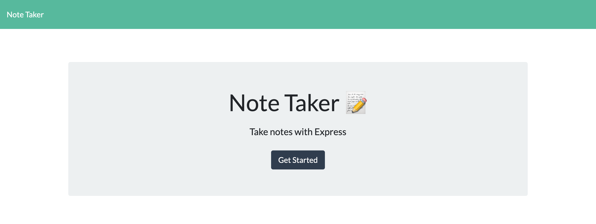
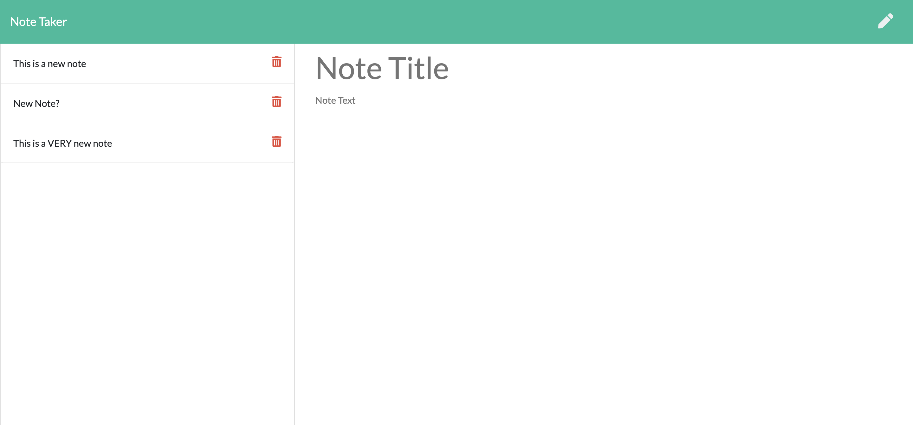

# Note Taker
This is a simple note taking application that can be used to create and save notes in the browser. A user can click the pencil icon to create a new note or can select existing notes present along the left hand side of the page. When a user enters in text for their new note, a save icon appears at the top of the screen than enables a user to save their new note. Users can also click on the trash can icon contained alongside the note titles to delete the corresponding note.

Here is a link to the deployed application: [Note Taker](https://infinite-springs-75538.herokuapp.com/)

Here are some screenshots of the application:

